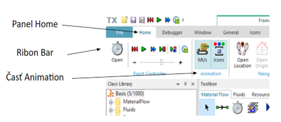

# Význam ukazovateľov stavu objektu

Objekty simulačného modelu sa môžu nachádzať v určitom prevádzkovom stave. Napr. objekt materiálového toku Station sa môže nachádzať v stave, že pracuje, čaká , je blokovaný atď. Stav týchto objektov je možné ukazovať pomocou zmeny ikony alebo pomocou farebných ukazovateľov ktoré sa zobrazujú pri ikone daného objektu. Zobrazovanie stavov pomocou ukazovateľov a zobrazovanie materiálového toku je možné zapnúť alebo vypnúť na Ribon bare na paneli Home v časti Animations tlačidlami MUs a Icons, ako ukazuje obrázok.

<figure><figcaption>
Zmena stavov ukazovateľov objektov
</figcaption></figure>

Základný význam jednotlivých stavov objektov sumarizuje tabuľka:

|                    |                                                                          |                  |
| ------------------ | ------------------------------------------------------------------------ | ---------------- |
| Stav objektu       | Uážka                                                                    | Farba Indikátora |
| Blokované          |  | Žltá             |
| Závada             |                                         | červená          |
| Pauza              | .png>)                                  | modrá            |
| ZapínanieVypínanie | .png>)                                  | fialová          |
| Reštartovanie      | .png>)                                 | tyrkysová        |
| Nastavovanie       | .png>)                                  | hnedá            |
| Zastavovanie       | .png>)                                  | ružová           |
| Neplánované        | .png>)                                  | slabo modrá      |
| Čakanie            | .png>)                                  | oranžová         |
| Práca              | .png>)                                  | zelená           |

V prípade nášho jednoduchého modelu je možné vidieť len stav Práca (zelený indikátor) kedy stanica vykonáva činnosť a stav Blokovanie (žltý indikátor) kedy objekt Source čaká na to kým stanica vykoná prácu a uvoľni miesto pre ďalšie MU ktoré sa bude spracovávať.

