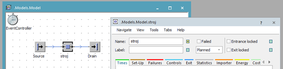
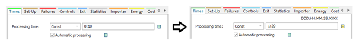

# Zmena základných vlastností objektu Station

Dvojklikom na objekt station v základnom simulačnom modeli sa otvorí dialógové okno nastavenia tohto objektu. Základná vlastnosť ktorú je možné meniť je meno (Name) objektu. V prípade zmeny vlastnosti Name objektu platí zásada:

**!!!nepoužívať pri menách objektov ani celkovo diakritiku a ani medzery!!!**

Vlastnosť objektu Name je špecifická pre daný objekt, nemôže byť v projekte viac objektov z rovnakým menom, a využíva sa na volanie objektu z ktorejkoľvek časti projektu. Zmeňme vlastnosť Name objektu Station na stroj tak ako ukazuje obrázok:

<figure><figcaption>
Zmena vlastnosti Name objektu Station
</figcaption></figure>

Zmena názvu sa prejavila v popise objektu na hlavnom okne. Vedľa každej vlastnosti ktorú je možné nastavovať sa štandardne nachádza zeleno-modrý štvorček. Tento znázorňuje že vlastnosť je zatiaľ nezmenená, jej hodnota je zdedená z predchodcu. Pokiaľ vlastnost zmeníme štvorček zmení farbu . Táto zmena indikuje zmenu implicitne nastavených vlastností objektu. Zmeny sa aplikujú až po poklepaní na tlačidlo Apply . Poklepaním na tento štvorček po zmene vlastností je možné nastaviť danú vlastnosť do pôvodného stavu(zdediť vlastnosť po rodičovi).

Vlastnosti objektu sú usporiadané do skupín ktoré sa nachádzajú na kartách dialógového okna. V prípade objektu Station sa jedná o karty: “Times”, ”Set-Up”, ”Failures”, ”Controls”, ”Exit”, “Statistic”, “Importer”, “Energy”, “Cost” a “User-defined”. V prípade že chceme zmeniť dĺžku času práce stanice s aktuálnym MU, je možné toto nastaviť na karte Time zmenou položky Processing Time. Implicitne je táto položka nastavené na 10s. Zmeňme toto nastavenie na 1min 20s zadaním 1:20 a kliknutím na tlačidlo ako ukazuje obrázok:

<figure><figcaption>
Princíp zadávania veličín času
</figcaption></figure>

Aj v prípade zmeny vlastnosti času, zmení sa aj indikátor dedičnosti z na . Nad oknom zadávania času je zobrazená nápoveda ktorá ukazuje formát zadávania času “DDD:HH:MM:SS.XXXX”. To znamená, že Dni-DDD, hodiny-HH, minúty-MM a sekundy-SS sú oddelené znakom dvojbodka ”:”. Ak je potrebné tak je možné zadávať aj desatiny, prípadne stotiny sekundy za znakom bodka”.” ktorý reprezentuje desatinnú čiarku. V prípade že zadáme údaj len v skundách “napr. 3860” po kliknutí na tlačidlo Apply sa automaticky tento údaj pretransformuj na 1 hod. 4 min. a 20 sekúnd “1:04:20”.
